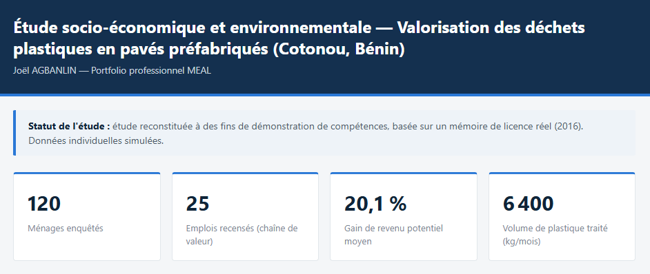

# Valorisation des déchets plastiques en pavés préfabriqués — Cotonou, Bénin

Dashboard interactif présentant une étude socio-économique et environnementale sur le potentiel d'une filière de valorisation des déchets plastiques en pavés préfabriqués à Cotonou, structurée autour de 4 axes : **emploi, revenus, vie sociale et environnement**.

**Dashboard en ligne :** https://jagbanlin95.github.io/portfolio-meal-paves-cotonou/



## Statut de cette étude

Ce projet reconstitue, à des fins de démonstration de compétences professionnelles (portfolio MEAL / Planification & Coordination), la méthodologie d'une étude réellement menée dans le cadre d'un mémoire de Licence en Économie Appliquée (FASEG-UAC, 2016), avec l'appui de CISE SARL. Les données individuelles présentées dans les fichiers CSV sont **simulées** ; la structure de l'enquête, les indicateurs et la méthodologie reflètent en revanche la démarche réellement appliquée.

## Contexte

La gestion des déchets plastiques constitue un défi environnemental majeur pour les villes d'Afrique de l'Ouest, notamment à Cotonou où l'accumulation de plastique dans les caniveaux contribue aux inondations urbaines récurrentes. La valorisation de ces déchets en pavés préfabriqués représente une opportunité d'économie circulaire à la fois environnementale et socio-économique.

L'étude combine deux volets :
- **Volet ménages (N=120)** — enquête d'acceptabilité sur 3 quartiers de Cotonou (Akpakpa, Dantokpa, Fidjrossè)
- **Volet acteurs de la chaîne de valeur (N=25)** — collecteurs et artisans, pour estimer le potentiel de création d'emplois et de revenus

## Ce que montre le dashboard

- **4 indicateurs clés** : ménages enquêtés, emplois recensés, gain de revenu potentiel moyen, volume de plastique traité par mois
- **Acceptabilité par quartier** : taux de tri, de connaissance de la filière et de disposition à l'achat de pavés recyclés
- **Revenu actuel vs potentiel** par type d'acteur (collecteurs, artisans), présenté explicitement comme un scénario projeté et non une mesure d'impact observée

## Méthodologie et limites

- Échantillonnage de convenance (non probabiliste), cohérent avec les moyens d'une étude de mémoire de licence
- Résultats indicatifs à l'échelle des zones enquêtées, non généralisables statistiquement à l'ensemble de la ville de Cotonou
- Le revenu "potentiel" est une projection (+15 à +25 %), pas une mesure d'impact réelle — la filière structurée n'existe pas encore à l'échelle

Une analyse économétrique complémentaire (régression logistique, Stata) a également été menée pour identifier les déterminants de l'acceptabilité — disponible dans le rapport complet du projet.

## Stack technique

- HTML / CSS / JavaScript (fichier unique, aucune dépendance de build)
- [Chart.js](https://www.chartjs.org/) — visualisation des graphiques
- [PapaParse](https://www.papaparse.com/) — lecture des fichiers CSV côté client

## Lancer en local

```bash
git clone https://github.com/jagbanlin95/dashboard-meal-paves-cotonou.git
cd dashboard-meal-paves-cotonou
python3 -m http.server 8000
# puis ouvrir http://localhost:8000
```

> Le dashboard charge les CSV via `fetch()` : ouvrir directement `index.html` par double-clic ne fonctionne pas dans certains navigateurs (restriction de sécurité sur les fichiers locaux). Utiliser un serveur local ou consulter la version en ligne.

## Auteur

**Joël AGBANLIN** — Planification, Coordination & MEAL
[LinkedIn](https://www.linkedin.com/in/joel-agbanlin) · agbanlin.joel@gmail.com
